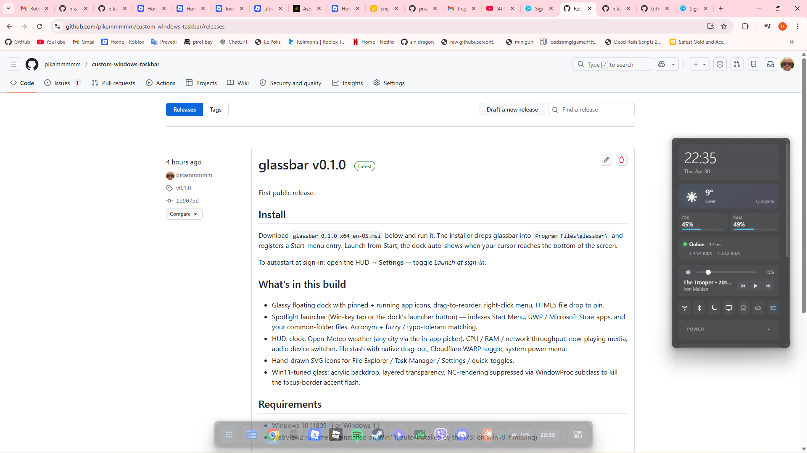
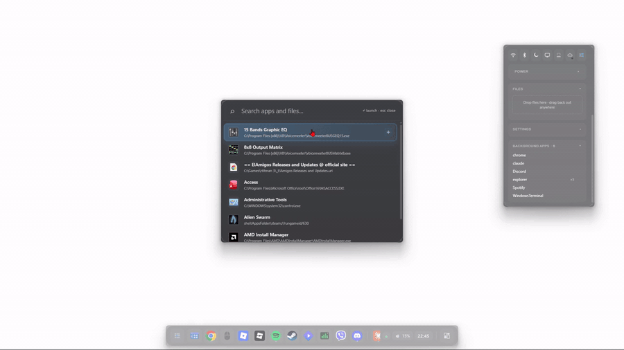
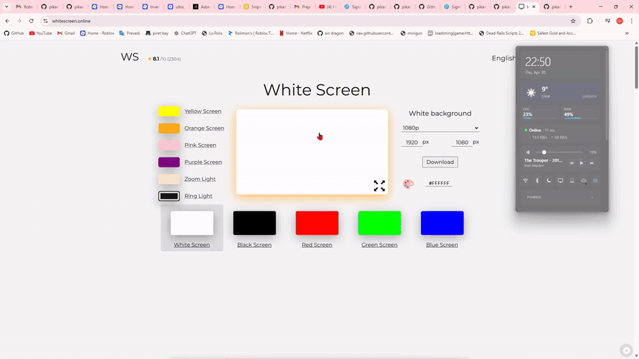

# glassbar

A glassy, always-on-top floating dock + HUD for Windows. Coexists with the auto-hidden Windows taskbar.

[](https://github.com/pikammmmm/custom-windows-taskbar/releases/latest)





> Status: early release (v0.1.0). Bugs and rough edges expected on
> non-1080p / multi-monitor / fractional-DPI configurations. Issues and
> PRs warmly welcomed.

## Features

- **Dock** — pinned + running app icons, click to launch / focus / minimize, right-click for window list + pin / unpin, drag to reorder. Auto-shows on cursor-bottom, slides away when you leave.
  
- **Spotlight launcher** — Win-key tap or the dock's launcher button opens a glassy search overlay. Indexes the Start Menu, UWP / Microsoft Store apps (via `Get-StartApps`), and files in your common folders. Acronym + fuzzy / typo-tolerant matching.
- **HUD** — clock, Open-Meteo weather (any city via the in-app picker), CPU / RAM / network throughput, now-playing media, audio device switcher, file stash with native drag-out, Cloudflare WARP toggle, system power menu. Drag to reposition, click the dock toggle to show / hide.
  
- **Glass** — Win11 acrylic backdrop, layered transparency, hand-drawn SVG icons for system apps.

## Install

> Free code signing on Windows provided by [SignPath.io](https://signpath.io/),
> certificate by the [SignPath Foundation](https://signpath.org/).

All downloads live on the [Releases page](https://github.com/pikammmmm/custom-windows-taskbar/releases/latest):

| File | Size | What it is |
|---|---|---|
| `glassbar_<version>_x64_en-US.msi` | ~2.7 MB | Installer (recommended) |
| `glassbar.exe` | ~5.5 MB | Portable main app |
| `uninstall.exe` | ~280 KB | Uninstaller — restores the Windows taskbar and wipes user data |

### Option A — Installer (recommended)

1. Download and run the MSI.
2. Installs to `Program Files\glassbar\`, adds a Start-menu entry, registers an Apps & Features uninstaller, and drops `uninstall.exe` next to the main app.
3. Launch glassbar from Start. The dock auto-shows when your cursor reaches the bottom of the screen.
4. (Optional) Open the HUD → **Settings** → toggle *Launch at sign-in* for autostart.

### Option B — Portable

1. Download `glassbar.exe` (and `uninstall.exe` if you want a clean teardown later) and put them in the same folder, e.g. `C:\Tools\glassbar\`.
2. Double-click `glassbar.exe` to run — no install, no admin prompt, no Start-menu entry.
3. To autostart, drop a shortcut into `shell:startup` (paste that into Run / File Explorer) or toggle *Launch at sign-in* in the HUD's Settings.

## Uninstall

Pick whichever is more convenient:

- **MSI build** — Settings → Apps → Installed apps → glassbar → Uninstall.
  - Or run `uninstall.exe` from `Program Files\glassbar\` (it ships next to `glassbar.exe`). It hands off to `msiexec /x`, restores the Windows taskbar, removes autostart, and wipes user data + cache.
- **Portable** — download `uninstall.exe` from the [Releases page](https://github.com/pikammmmm/custom-windows-taskbar/releases/latest) (or run the one already next to your portable `glassbar.exe`). It runs the same cleanup steps, then you delete `glassbar.exe` yourself.

Either path also restores the standard Windows taskbar in case glassbar was killed without its exit handler running — that's the part you can't get back via "delete the file" alone.

## Privacy

glassbar does not collect, store, or transmit any user data — no analytics,
no telemetry, no crash reporting, no phone-home, no account system.

**What stays on your machine:**
- Pinned apps, HUD position, stash files, autostart preference, weather city
  selection — all in `%APPDATA%\glassbar\` (cleared by the uninstaller).
- WebView2 cache for the dock / HUD UI in `%LOCALAPPDATA%\com.glassbar.app\`.
- Spotlight's app index (built from your Start Menu and `Get-StartApps`)
  and file index (your `Desktop` / `Documents` / `Downloads` / `Pictures` /
  `Videos` / `Music` folders) — held in process memory only.
- Claude Code transcripts under `%USERPROFILE%\.claude\projects\` are read,
  but only locally — nothing leaves the machine.

**The only outbound network requests:**
- `api.open-meteo.com` and `geocoding-api.open-meteo.com` — fetches the
  current weather for the city you select in HUD → Settings. Sends the
  city name (geocoding) and lat/lon (forecast). No API key, no account.
- `warp-cli` invocations talk to Cloudflare WARP locally; if WARP is
  active, your traffic flows through Cloudflare's network, but glassbar
  itself only toggles WARP — it doesn't transmit data through it.

That's it. There is no first-party server, no third-party SDK, no
identifier sent anywhere. Source is fully open under MIT for inspection.

## Build from source

Requires Rust (stable). The WiX Toolset is needed for the MSI bundle and ships preinstalled on `windows-latest` GitHub runners.

```bash
cargo install tauri-cli --version "^2.0"
cd src-tauri
cargo tauri build
```

The MSI installer is written to `src-tauri/target/release/bundle/msi/`.

## Releasing

Tag a commit with `vX.Y.Z` and push the tag. `.github/workflows/release.yml` runs `cargo tauri build` on a Windows runner and attaches the MSI to a GitHub Release automatically:

```bash
git tag v0.1.0
git push origin v0.1.0
```

A manual run is also wired in via the workflow's *Run workflow* button — that leaves the MSI as a workflow artifact instead of publishing a release.

## Configuration

Files live in `%APPDATA%\glassbar\glassbar\data\`:

- `pinned.json` — array of `{ "path", "display_name", "icon_path"? }`. Hot-reloaded on save.
- `settings.json` — `{ "hud_position": [x, y]?, "auto_start": bool }`.

A starter `pinned.example.json` ships in the repo.

## Auto-start at login

Toggle from the dock devtools (or call `set_autostart` programmatically). Disabled by default.

## Requirements

- Windows 10 (1809+) or Windows 11
- WebView2 runtime (preinstalled on Win11)

## Limitations (v1)

- Single primary monitor only.
- No third-party system tray hosting (planned).
- No in-app settings UI — edit JSON for now.
- One glass theme.
